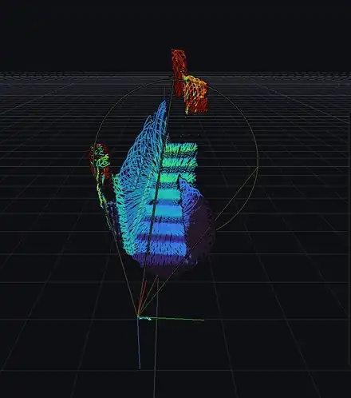
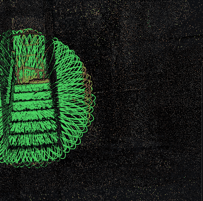
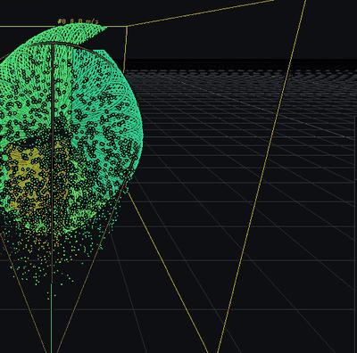
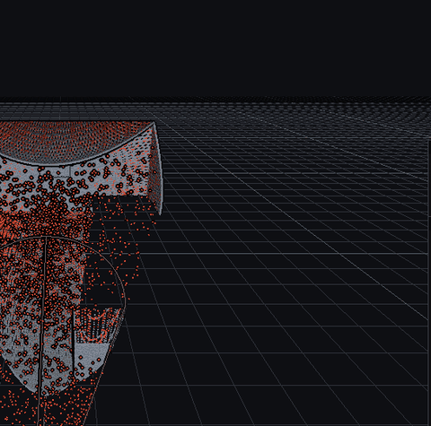

# livox-warp

A Livox LiDAR viewer with a native Rust protocol stack and an NVIDIA Warp GPU pipeline. It speaks
the original Livox SDK protocol (Mid-40/100, Mid-70, Horizon, Tele-15, Avia), replaces Livox Viewer
with explicit control over the network, the device and the processing, and adds LiDAR-only SLAM,
scene understanding and localisation in an earlier scan of the place, all built for the Mid-40: no
IMU, a 38.4 deg circular field of view and a non-repetitive rosette scan.

```
LiDAR ──UDP──> Rust (crates/livox)            Python + Warp (python/livox_warp)           OpenGL
               discovery, handshake,   bytes  ring buffer, filters, pose table,  CUDA-GL  points or
               heartbeat, commands,   ──────> deskew, odometry (scan-to-map ───────> surfels + EDL
               point decode, record            ICP), voxel map + carving,        interop  + overlays
                                               ground, clusters, tracks,                  + imgui
                                               prior-map localisation
```

Everything per point after the socket runs as Warp kernels, and the last kernel writes straight
into the OpenGL vertex buffers (no host round trip). The Stats panel says so in green, or shows a
red CPU FALLBACK if CUDA-GL interop is ever unavailable.



*Live handheld mapping with a Mid-40, shown at 4.5x speed: the scan-to-map odometry builds the room as the scanner moves.*

| localised in an earlier scan of the building | SLAM in the simulated office | carving the ghosts a walker leaves |
|---|---|---|
|  |  |  |
| a handheld walk replayed; green matches the scan, red is new since it was made | odometry path, ground, clusters and velocity arrows, all on the GPU | the integration map in Motion colours while free-space carving clears what moved |

## Install

Prerequisites: an NVIDIA GPU with a current driver (Warp runs the kernels on CUDA), Python 3.10 or
newer, and a Rust toolchain (1.87 or newer) for the protocol crate and the Python extension.

```
pip install maturin
pip install .                      # builds the Rust extension and installs the `livox-warp` command
pip install ".[prior-map]"         # adds open3d and pye57 for localisation in an E57 scan
```

For development, `pip install -e . --no-build-isolation` installs the checkout in place and drops
the extension next to the Python package; after changing Rust code run `maturin develop --release`
again. `livox-warp.bat` is a from-checkout convenience that runs `python -m livox_warp` with the
checkout on the path (it needs that extension built). The command-line tool builds with
`cargo build --release -p livox-cli` and needs no Python.

## Run

```
livox-warp                         # discovers the LiDAR and connects to the first reachable one
livox-warp --lidar <lidar-ip> --host <local-ip>
livox-warp --replay recordings\run.lvxr --speed 2
livox-warp --sim                   # Warp-simulated Mid-40, no hardware
livox-warp --sim --sim-motion walk --sim-scene office --odom --ground --clusters
livox-warp --prior-map maps\prior_20mm.npz --odom --color changes
livox-warp --help                  # every option
```

Close Livox Viewer first: it binds UDP 55000 to one address, which hides the LiDAR's broadcasts.

The viewer mount pose (View > Mount pose, e.g. roll 180 for a scanner used upside down) is the one
setting remembered between runs, in `%APPDATA%\livox-warp\viewer.json` (`~/.config/livox-warp` on
Linux); `--config PATH` uses another file. Everything else starts from its default or its command
line flag.

## What you control that Livox Viewer doesn't let you

- **Which local address the LiDAR streams to.** Livox Viewer uses the first IPv4 that Windows
  reports for the adapter and refuses LiDARs on any other subnet. Here each discovered LiDAR has a
  host-IP picker. If no local address is on its subnet, one button adds one (admin prompt)
  without dropping DHCP.
- **Device:** start/stop sampling, work mode, return mode, fan, rain/fog, IMU, IP config
  (static/DHCP plus reboot), the mount pose stored on the LiDAR, and raw packet recording for
  bit-exact replay.
- **Processing (GPU):** live persistence window or a voxel-hash integration map, radius outlier
  removal, range/reflectivity/noise-tag/return/crop filters, viewer mount pose, and colors by
  reflectivity, height, range, age, curvature, normal, lit (PCA normals), return, noise tag or
  device.
- **Output:** PLY or LAS 1.4 export of exactly what is on screen (LAS carries RGB, intensity, GPS
  time and ASPRS ground/non-ground classification when ground segmentation is on), screenshots, and
  frame sequences for animations (`--frames-dir`).

## SLAM and perception (Perception panel)

All of it runs as Warp kernels on the points already on the GPU.

- **LiDAR-only odometry (O).** Points are cut into 0.1 s frames by their timestamps, deskewed to
  mid-frame with the sensor's motion (a turning sensor otherwise smears a wall 10 m away by up to
  half a metre per frame), thinned, and registered scan-to-map against a voxel map that keeps each
  voxel's mean and covariance. Every live point is drawn through its own frame's pose and deskewed
  by its own timestamp, so the live window and the integration map both become one world map while
  the sensor moves. The path is drawn in the scene and the camera follows the sensor (V). Hold the
  sensor still for the first second: those frames seed the map. See "How the odometry works" below.
- **Ground segmentation (G).** Grid-based: lowest supported return per 0.5 m cell, a slope
  allowance between cells, steep normals rejected. Colors non-ground by its height above the floor
  it stands over (a crate top reads its real height), can hide the ground, and labels LAS exports.
- **Clusters and tracking (K).** GPU connected components of the non-ground points (iterated until
  the labels converge, so a long wall stays one cluster), then a nearest-neighbour tracker on sensor
  time: velocity is a least-squares fit over the last 0.8 s, reported only when it is significant, so
  static objects read 0 m/s at any frame rate. Boxes, velocity arrows and labels in the scene, and a
  Speed color mode (a software stand-in for the per-point velocity FMCW LiDARs measure).
- **Motion from map history.** The integration map remembers when each voxel first appeared, and
  free-space carving (X) ray-traces returns through the map to count how often each voxel is seen
  through. A ray counts against a voxel only where it crosses the surface patch inside it, and it
  stops short of its own return by a margin that grows at grazing angles, so floors and stair treads
  are not eroded. The Motion color mode marks points in see-through voxels, or in new voxels with no
  old neighbour (a new voxel next to an old one is the rosette filling in a known surface). Carving
  hides the ghost trails moving objects leave in the map. Ghosts clear as rays cross them: at 12 m a
  2 cm voxel sees about one ray a second, so coarser voxels clear faster. Porous objects (railings,
  racks) are genuinely seen through and can read as moving.
- **Surfels (S).** Points drawn as discs on their PCA normals, so a sparse scan reads as a surface.

### How the odometry works, and how well

A 38 deg cone sees little at a time, so the hard part is not registration but its biases. Two of
them decided the design:

- **Partly seen surfaces.** At the leading edge of a turn, far voxels hold only one or two passes of
  the rosette: a line or a blob of points whose "normal" is arbitrary. Treated as surfaces they pull
  every new point back toward what the map already saw, and the sensor under-rotates. Such voxels
  give only a weak pull, and a Geman-McClure kernel drops far residuals entirely.
- **Directions the view cannot observe.** Looking at one wall and the floor, sliding along the wall
  and rolling about the optical axis are unconstrained. The information of the surface normals alone
  is examined in sensor coordinates; directions below a threshold are held at the motion prediction,
  and the prediction comes from a smoothed velocity so one bad frame cannot become the velocity of
  every frame after it. The Perception panel shows how many directions are held.
- **Keyframes.** After warm-up a frame is merged into the map only once the sensor has moved 5 cm or
  1 deg, so a standing sensor registers against a fixed map instead of one that follows its own
  estimate.

Measured with `tests/check_odometry.py` and `tests/check_real_static.py`:

| case | error |
|---|---|
| simulated, standing | 0.1 cm |
| simulated, turning in place | 0.3 cm |
| simulated, walking 8 m with turns up to 30 deg/s, bare room (5 runs) | 3.4-6.0 cm rmse |
| simulated, the same walk in a furnished office (3 runs) | 1.4-1.7 cm rmse |
| real Mid-40, standing (4 recordings x 5 runs, worst run) | ends within 0.7 cm / 0.4 deg; jitter up to 1.3 cm / 0.5 deg, mostly roll |
| real handheld walk, 54 s, against a terrestrial scan of the building | within 15 cm / 2.3 deg; 2.0 cm median with the prior map's drift correction |

Registration takes about 3-7 ms per 0.1 s frame. It runs on its own thread and CUDA stream through
`warp_worker` (vendored from github.com/nhaumann/warp-worker): batches go in and finished frames come
back as owned snapshots, so drawing never waits on a Gauss-Newton readback. Under render load the
render loop's p99 frame time went from 8-12 ms with inline odometry to about 4 ms, with no torn
snapshots in 208 checked (a borrowed-view control tears 59 of 59, so the detector works).

One limit is physical: walking along a flat wall that fills the 38 deg view, sliding along the wall
is unobservable, so the odometry under-counts the walk and cannot recover by itself. A prior map can
re-find the pose afterwards.

### Prior map: localise in an earlier scan of the place

With a terrestrial scan of the building (an E57), the viewer can place the Mid-40 in it, show what
changed, and keep the odometry from drifting:

```
python -m livox_warp.prior_map convert scan.e57 --voxel 0.02 --out maps\prior_20mm.npz
livox-warp --prior-map maps\prior_20mm.npz [--odom]
```

- **Localisation, about a second.** The scan's floors and ceilings give gravity (both signs, so an
  upside-down scanner is fine), the heights of its horizontal surfaces are matched to the map's to
  pick plausible sensor heights, every position on a 25 cm grid and heading in 2 deg steps is scored
  on the GPU against a distance field of the map, and the best few are refined together by a batched
  point-to-plane ICP. It reports whether the answer is unique; a repetitive place (a long hallway)
  can be ambiguous, and then the panel says so and offers to use it anyway. Without odometry, hold
  the scanner still for 2 s.
- **Drift correction.** The odometry keeps its own world frame; every half second the last second of
  points is registered to the scan from the current alignment (starting also from +-20 cm offsets,
  because a staircase has near-equal fits one step apart), and the alignment is replaced only if the
  result fits, moved it by less than 0.5 m / 5 deg, and either is a small step or fits clearly better
  than before (facing one wall, a registration can slide along it with no change in fit). Three poor
  fits in a row mark the pose lost; the last pose is then re-tried from nearby starts before a new
  global search, and a global answer far from where the scanner last fitted is ignored.
- **Changes colours.** Every visible point is coloured by its distance to the scan: green within
  3 cm, amber within 10 cm, red beyond (new or moved). The scan can be drawn, dimmed, for context.

Measured with `tests/check_prior_map.py` on our data: a static recording facing a staircase
localises in 0.7 s within 0.5 cm / 0.13 deg of a 3-minute exhaustive search; 86% of its points match
the scan and 8% are new (a railing and objects added since). On a handheld walk the corrected poses
are within 2.0 cm (median, 4.9 cm p90) of a frame-by-frame scan registration wherever that
registration is solid.

## Keys

| key | action | key | action |
|---|---|---|---|
| drag left | orbit | F | freeze |
| drag right / shift+left | pan | C | clear |
| wheel | zoom | M | live window / integration map |
| R | reset camera | E | eye-dome lighting |
| T | top view | D | denoise |
| 1-9, 0 | color mode | P | screenshot |
| O | odometry on/off | G | ground segmentation |
| K | clusters + tracking | X | free-space carving |
| S | surfels | V | follow sensor |

## Command line tool

`livox` (from `cargo build --release -p livox-cli`) talks to the device without the viewer:

```
livox discover
livox info   --lidar <lidar-ip>
livox stream --lidar <lidar-ip> --secs 10 --record recordings\run.lvxr
livox set-ip --lidar <lidar-ip> --static <new-ip>/24 --reboot
livox mode   --lidar <lidar-ip> standby            # normal | power-save | standby
livox info   --lidar <lidar-ip> --type mid70       # mid40 (default) | mid70 | horizon | tele15 | avia
```

## Protocol notes

Taken from the Livox-SDK sources and checked against a real Mid-40:

- Frames carry CRC-16/MCRF4XX seeded `0x4C49` over the preamble and CRC-32 seeded `0x564F580A`
  over the whole frame. Broadcasts from the hardware validate with both.
- The SDK sends the handshake with packet type ACK (1). This code does the same, then falls back
  to CMD (0).
- Mid-40 firmware answers "get IP" with only mode and address, and ignores return-mode commands.
- The first data packet after a handshake carries a stale timestamp (about 16 minutes off).
  The sink treats forward jumps over 1 s as clock jumps, not packet loss.
- The firmware version is four bytes in the documented order; an earlier reading reversed them.

Livox's dual-return firmware for the Mid series is supported and detected from the firmware version;
see [docs/mid40-dual-return-firmware.md](docs/mid40-dual-return-firmware.md).

## Data, tests and benchmarks

The tests that need real data look for it under `LIVOX_DATA_DIR` (default: the checkout), in this
layout, and skip cleanly when a file is missing:

```
recordings/*.lvxr            raw packet recordings (viewer: LiDAR > Recording, or `livox stream --record`)
maps/prior_20mm.npz          a prior map: python -m livox_warp.prior_map convert scan.e57 --voxel 0.02
maps/recording_poses.npz     sensor poses of static recordings in the prior map: python -m livox_warp.localize
maps/walk_reference.npz      a frame-by-frame reference trajectory for a walk (optional)
```

`LIVOX_RECORDING`, `LIVOX_STATIC_RECORDINGS` (several paths, separated like PATH),
`LIVOX_WALK_RECORDING` and `LIVOX_PRIOR_MAP` point individual tests at particular files;
`LIVOX_DEVICE=cpu` runs the Warp kernels on the CPU backend; `LIVOX_SIM_SCENE=office` runs the
odometry test in the furnished room. See `tests/README.md`.

```
cargo test -p livox                    # framing, CRCs, point decoding
python tests/run_all.py                # every check below, with OK / FAIL / SKIP per script
python tests/smoke_pipeline.py         # Warp pipeline, headless
python tests/check_odometry.py         # SLAM vs simulated ground truth (position, rotation, registration)
python tests/check_real_static.py      # SLAM on real static recordings: no drift, 5 runs each
python tests/check_slam_worker.py      # threaded SLAM: accuracy, torn snapshots, render-loop decoupling
python tests/check_perception.py       # ground, clusters, tracks, motion, carving (sim and real data)
python tests/check_prior_map.py        # localisation, drift correction, Changes colours (real data)
python tests/check_mid40_dual.py       # dual-return decoding and return filters
python tests/check_normals.py          # voxel-summary normals vs exact PCA
python benchmarks/bench_prior_map.py recordings/walk.lvxr   # SLAM drift against a prior scan, per half second
python benchmarks/bench_neighbors.py   # neighbourhood analysis: exact vs voxel summary
python tools/calib_prior_map.py        # range bias, noise and per-angle errors of the sensor vs a prior scan
```

The GPU odometry is not bit-for-bit repeatable (atomic accumulation order), so the real-data tests
run each recording several times and judge the worst and the median run.

`bench_prior_map.py` benchmarks a handheld recording (start it standing still for 1.5 s) against
the scan itself: per half second, how well the free odometry's points still fit the scan, how far the
prior-map session had to move it, and whether it is lost. A frame-by-frame scan registration is not
used as ground truth, because it fails exactly where the SLAM is hard.

`calib_prior_map.py` on our Mid-40, against a terrestrial scan: no range bias (0.3 mm) or scale
(-0.09 mm/m); 1.0-1.2 cm noise overall, 4-6 mm within 8 deg of the optical axis and 12-18 mm at the
edge of the field of view (which also reads about 1 cm short); second returns of the dual-return
firmware sit 4 cm in front of the surface with 5 cm noise, and returns with reflectivity below 20 are
biased by several cm. Registering first returns only (`Odometry.ret_mask = 1`) halves the jitter of a
standing scanner but costs about 0.6 cm on a walk, so the default keeps both.

## Development

`ruff check python tests benchmarks tools`, `cargo fmt --all --check`,
`cargo clippy -p livox -p livox-cli --all-targets -- -D warnings` and `cargo test -p livox` are what
CI runs (`.github/workflows/ci.yml`), plus a wheel build with maturin on Windows and Linux. The GPU
tests need hardware and run locally.

Layout: `crates/livox` (protocol, device sessions, recording), `crates/livox-cli`, `crates/livox-py`
(the `livox_warp._native` extension), `python/livox_warp` (GPU pipeline `gpu.py`, viewer `app.py`,
odometry `odom.py` + `slam_worker.py`, perception, prior map `mapgrid.py` / `localize.py` /
`prior_session.py`, simulator and sources), `python/warp_worker` (vendored), `tests`, `benchmarks`,
`tools`, `docs`.

## License

MIT, see [LICENSE](LICENSE). The vendored `warp_worker` package carries its own MIT license.
